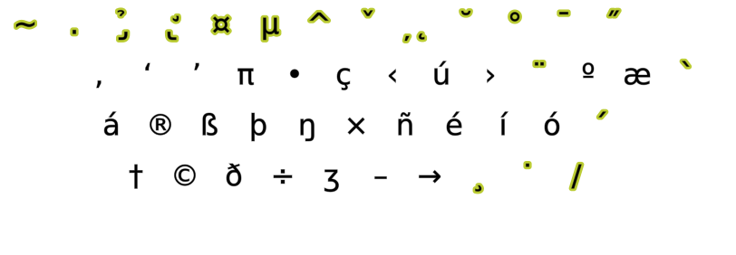

DreymaR's Big Bag Of Keyboard Tricks - EPKL
===========================================

  

Colemak[eD] locale layouts
--------------------------
Most of the Cmk-eD locale variants use ISO keyboards with an AngleWide configuration to allow index finger access to the bracket and ISO_102 keys where I mostly put the needed locale letters.
  
This may be supplemented with Curl(DH) and Sym mods to provide Colemak-CAW(S) with locale letters. You could remove the Wide mod if desired, but then the right hand pinky may get overworked.
  
Some locales traditionally use ANSI keyboards though, and some prefer to use the AltGr key instead of dead keys. So there may be other variants available.
 

Spanish Colemak locale layout variants
--------------------------------------
For Spanish/Latin locale Colemak, at the least we need the letters áéíóú and ñ easily accessible. There are two main solutions, depending on your preferences:
- **Cmk-eD-EsLat**: This is good both for Spanish and other languages, using dead keys on brackets for the main accents.
 

||
|   :---:   |
|_Colemak-eD-EsLat_ISO_CAWS, unshifted state. Accent DKs in the middle. For ANSI boards, ñ is on AltGr+n._|
 

- **Cmk-eD-EsAlt**: An alternative for those who prefer using AltGr. The letters áéíóú are easy to remember on AltGr+aeiou; ñ gets AltGr+n (and/or the ISO key on ISO boards).
 

||
|   :---:   |
|_Colemak-eD-EsAlt_ANS_CurlAngle, AltGr state_|
