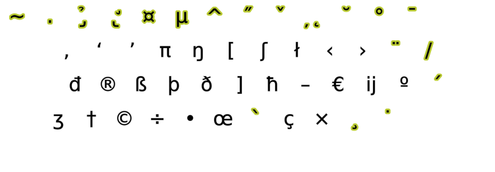

DreymaR's Big Bag Of Keyboard Tricks - EPKL
===========================================

  
  
Colemak[eD] locale layouts
--------------------------
Most of the Cmk-eD locale variants use ISO keyboards with an AngleWide configuration to allow index finger access to the bracket and ISO_102 keys where I mostly put the needed locale letters.
  
This may be supplemented with Curl(DH) and Sym mods to provide Colemak-CAW(S) with locale letters. You could remove the Wide mod if desired, but then the right hand pinky may get overworked.
  
Some locales traditionally use ANSI keyboards though, and some prefer to use the AltGr key instead of dead keys. So there may be other variants available.

Colemak-Nl Netherlands/Dutch locale layout
------------------------------------------
For Dutch locale Colemak, at the least we need accents easily accessible. There's also the ij digraph, but it's often written as a bigram (ij) instead. However, the J position in Colemak is bad.
- **Cmk-eD-Nl**
 

	||
	|   :---:   |
	|_Colemak-eD-Nl_ISO_AWide, unshifted state. Note the `ij` digraph on the ISO key._|

	||
	|   :---:   |
	|_Colemak-eD-Nl_ISO_AWide, shifted state. Note the `IJ` digraph on the ISO key._|

	||
	|   :---:   |
	|_Colemak-eD-Nl_ISO_AWide, AltGr state. Note the `ij` bigram on `AltGr+i`._|
